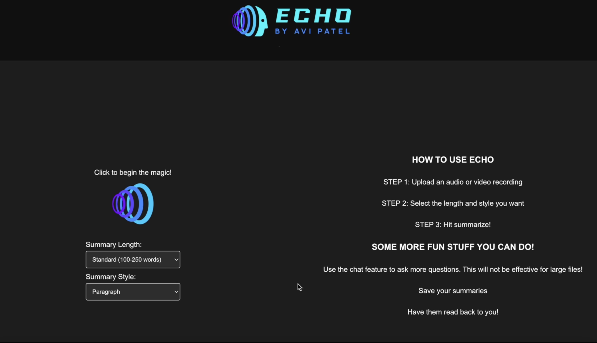
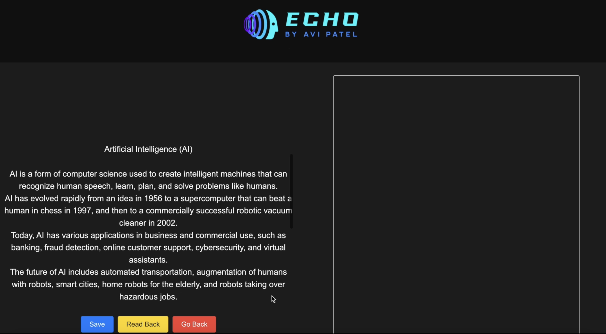
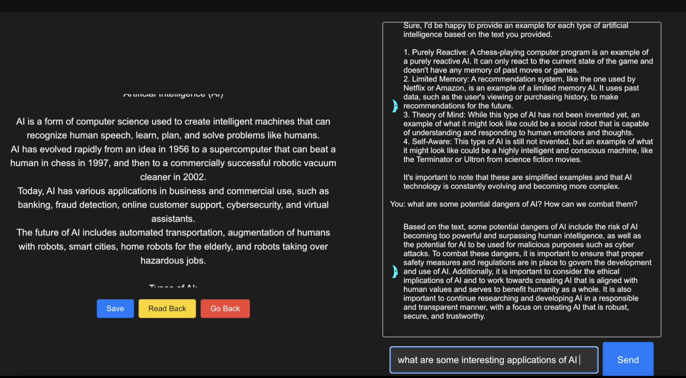

## Echo: AI Audio Summarizer 🔊📝


Echo is a powerful tool that transforms audio recordings into an interactive knowledge base. It provides highly accurate transcriptions and customizable summaries, and features a powerful AI chatbot that allows you to gain insights from hours worth of content in seconds.


## ✨ Key Features
1. 🎙️ High-Fidelity Transcription: Employs OpenAI's Whisper to accurately convert speech from audio files into text.
2. ✍️ Customizable Summaries: Tailor summaries to your exact needs before processing by choosing:
- Length: From a quick Compact summary to a Detailed overview.
- Style: Format the output as a Paragraph, Bulleted Points, a Blended mix, or a Structured response.
3. 💬 Interactive Q&A Chatbot: After generating a summary, you can:
- Query Your Document: Ask specific questions about the content of the audio ("What were the main arguments against the proposal?").
- Explore Beyond the Text: Ask questions that require external knowledge, leveraging the AI's general intelligence ("What are some applications of this technology not mentioned in the lecture?").
4. 🗣️ Text-to-Speech: Have the generated summary read aloud to you with a single click.
5. 💾 Save & Export: Instantly save your summary as a .txt file.
6. 🧩 Modular by Design: The backend is built with swappable components, making it easy for developers to integrate new or different models for transcription and language processing in the future.

## Important Note on AI Models
The original version of Echo used a private, university-hosted Mixtral model for its summarization and chatbot features. This model is no longer publicly accessible.

For a new user to enable the summarization and chatbot functionalities, you will need to modify the backend (summarizer.py and chatbot.py) to call a different LLM via an API (like OpenAI, Anthropic, Cohere, or a local model). The application's modular design makes this process straightforward. See the "For Developers" section below.

## Prerequisites
Before you begin, ensure you have the following installed:

Python 3.9+
FFmpeg: Whisper requires FFmpeg for audio processing.
On macOS: brew install ffmpeg
On Windows: Download from the official site and add to your system's PATH.
On Linux: sudo apt update && sudo apt install ffmpeg
An API Key for an LLM (e.g., OpenAI) to enable summarization/chat features.

## Create and activate a virtual environment (recommended):

# For macOS / Linux
python3 -m venv venv
source venv/bin/activate

# For Windows
python -m venv venv
.\venv\Scripts\activate

# Set up your environment variable:
Echo needs your OpenAI API key to function. The application is coded to read it from an environment variable called OPENAI_API_KEY.
1. Create a .env file in the root of the project directory:

2. Add this line to the file: OPENAI_API_KEY="your_secret_api_key_here"


Note: The application doesn't use python-dotenv, so you will need to load this variable into your shell session yourself or modify the code to use it.
Alternatively, you can set it directly in your terminal:
# For macOS / Linux
export OPENAI_API_KEY="your_secret_api_key_here"

# For Windows (Command Prompt)
set OPENAI_API_KEY="your_secret_api_key_here"

## 🏃‍♀️ Usage
Once the installation is complete, run the application with the following command:

python main.py
Use code with caution.
Sh
This will start the Gradio web server. Open your browser and navigate to the local URL provided in the terminal (usually http://127.0.0.1:7860).

## How to use the interface:
Choose Source Type: Select "YouTube" or "Upload".
Provide Input:
1. If "YouTube", paste the video URL into the "YouTube URL" field.
2. If "Upload", drag and drop or click to upload your audio file.
3. Select Model Size: Choose a Whisper model. base is a good starting point for a balance of speed and accuracy.
4. Click "Submit": Wait for the processing to complete.
5. View Results: The full transcription and the generated summary will appear in the output boxes.


## ⚙️ How It Works
1. On the home screen, select your desired Summary Length and Summary Style.
   
2. Click the central icon to upload an audio or video file.
   


3. Click Summarize! and wait for the transcription and summarization to complete.
   
4. Interact with your results on the main screen:
-Read the complete summary on the left.
-Click Save to download it, or Read Back to listen to it.



5. Use the chatbot panel on the right to ask follow-up questions.
   
6. Click Go Back to start over with a new file.
   



## 📂 Project Structure
```
echo/
├── assets/                 # Static assets like images and logos for the UI.
├── backend/                # Core logic for all AI functionalities.
│   ├── chatbot.py
│   ├── summarizer.py
│   ├── transcriber.py
│   └── tts.py
├── frontend/               # UI components built with Gradio.
│   └── app.py
├── .gitignore
├── main.py                 # Main entry point to run the application.
├── README.md
└── requirements.txt        # Python dependencies.
```

## 💻 For Developers: Making It Your Own
This project is designed to be easily adapted. To restore full functionality, you'll need to connect the summarizer.py and chatbot.py modules to an active Large Language Model.

# Example: Swapping in the OpenAI API

Open backend/summarizer.py.
Import the openai library and use your API key (loaded from the .env file) to make a call to the GPT-3.5/4 API.
Pass the transcribed text and a prompt constructed from the user's length/style preferences.
Repeat a similar process for backend/chatbot.py to handle the conversational logic.

## 🔮 Future Updates
The original vision for Echo included direct transcription from YouTube links. While this feature was deprecated due to model incompatibilities, it's a prime candidate for future development. With modern APIs, this could be re-integrated to make the tool even more versatile.


